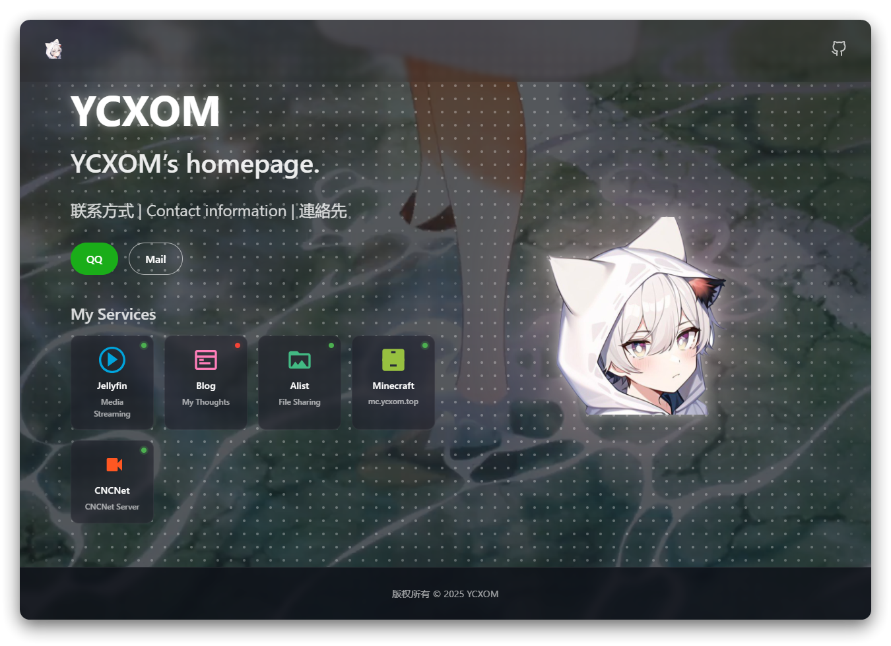

# Vue 3 + Vite



## 说明

 > │  App.vue                  // 主应用组件
 > │  main.js                  // 应用入口文件
 > │  style.css                // 全局样式
 > │
 > ├─assets                    // 静态资源目录
 > │  │  vue.svg               // Vue logo
 > │  │
 > │  ├─images                 // 图片资源
 > │  │      my-logo.png       // 项目logo
 > │  │
 > │  ├─styles                 // 样式文件目录
 > │  │      animations.css    // 动画样式
 > │  │      base.css          // 基础样式
 > │  │      components.css    // 组件样式
 > │  │      layout.css        // 布局样式
 > │  │      main.css          // 主样式
 > │  │      responsive.css    // 响应式样式
 > │  │      transitions.css   // 过渡样式
 > │  │      utilities.css     // 工具类样式
 > │  │
 > │  └─video                  // 视频资源
 > │          ANIPLEX.EXE『ATRI -My Dear Moments-』スペシャルアニメーションPV.mp4
 > │
 > ├─components                // Vue组件目录
 > │      AvoidanceIcon.vue    // 规避图标组件
 > │      DotPattern.vue       // 点状图案组件
 > │      Footer.vue           // 页脚组件
 > │      HelloWorld.vue       // 示例组件
 > │      LogoGlow.vue         // logo光效组件
 > │      ServiceIcon.vue      // 服务图标组件
 > │      VideoBackground.vue  // 视频背景组件
 > │
 > └─composables               // 组合式API目录
 > useServices.js       // 服务相关逻辑
 > useTheme.js          // 主题相关逻辑
 > useTransition.js     // 过渡效果逻辑

### 卡片修改

修改`ServiceIcon.vue`即可修改卡片跳转

---------
主力，来自强大的Claude！

- 本地测试环境

```shell
pnpm i
pnpm run dev
```

## 官方文档

---------
This template should help get you started developing with Vue 3 in Vite. The template uses Vue 3 `<script setup>` SFCs, check out the [script setup docs](https://v3.vuejs.org/api/sfc-script-setup.html#sfc-script-setup) to learn more.

While this project uses Vue.js, Vite supports many popular JS frameworks. [See all the supported frameworks](https://vitejs.dev/guide/#scaffolding-your-first-vite-project).

## Deploy Your Own

Deploy your own Vite project with Vercel.

[]([https://vercel.com/new/clone?repository-url=https://github.com/vercel/examples/tree/main/framework-boilerplates/vite&template=vite](https://vercel.com/new/clone?demo-description=Vite%2FVue.js%20site%20that%20can%20be%20deployed%20to%20Vercel&demo-image=%2F%2Fimages.ctfassets.net%2Fe5382hct74si%2F2T4BUF3mEBKPJF3jcjU6nS%2F0d4a02e7c48091d13814a4ab513e8734%2FScreen_Shot_2022-04-13_at_10.05.56_PM.png&demo-title=Vite%20-%20Vue&demo-url=https%3A%2F%2Fvite-vue-template.vercel.app%2F&from=templates&project-name=Vite%20-%20Vue&repository-name=vite-vue&repository-url=https%3A%2F%2Fgithub.com%2Fvercel%2Fvercel%2Ftree%2Fmain%2Fexamples%2Fvite&skippable-integrations=1))

_Live Example: <https://vite-vue-template.vercel.app>_

### Deploying From Your Terminal

You can deploy your new Vite project with a single command from your terminal using [Vercel CLI](https://vercel.com/download):

```shell
vercel
```
